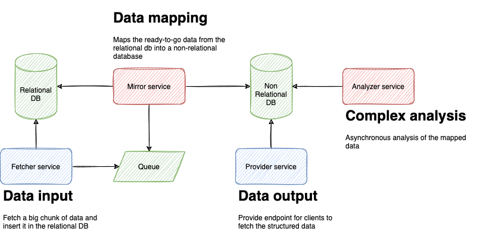

# CQRS example

CQRS stands for Command and Query Responsibility Segregation, a pattern that separates read and update operations for a data store.

We'll create a fictional scenario where a few services communicate in order to fetch some big chunk of data, asynchronous and incrementally insert it into a relational database, wait until it's ready to process and map it to a non-relational database, then asynchronous analyze each mapped document, while providing an endpoint to fetch it.

# Get started

We're using [docker-compose](https://docs.docker.com/compose/) to manage our infrastructure (as database and other services). After installing docker-compose in your machine, just run `docker-compose up -d` to set up everything.

The next step is set the relational database. To do so, access the `/sql-database` directory and read its README file.

After setting up the database, you can start the `/fetcher` and `/mirror` services. Go to their directories and read their README files to do that.
