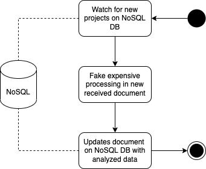

# Analyzer service

The analyzer service mocks an expensive operation, as it was analyzing some fetched big data and generating some processed information, updating it.

We're using the [Mongoose](https://mongoosejs.com/) library to communicate with the non-relational database, which in this case is a MongoDB Server. The MongoDB Server is also created through our docker-compose environment. Also, we're using the [MongoDB Compass](https://www.mongodb.com/products/compass) as an IDE to help up to manage the MongoDB collections.

To run this service, just go and `yarn dev`

