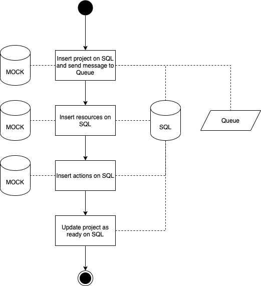

# Crawler service

The crawler service mocks highy expensive operations of data crawling. Through pre-existing mocks, we'll use some timeouts to fake slow fetching operations and insert the "fetched" data into our relational database.

To communicate with the relational database, we'll use [Prisma](https://www.prisma.io/) as our ORM. Its setup is very straight-forward and Prisma have great docs. But, in summary, we've ran `npx prisma init` to initialize the Prisma library. Then, we've set our connection string in our `.env` file (which you can copy and paste from the `.env.copy` file), then we run `npx prisma db pull` to generate Prisma's schema, and `npx prisma generate` to generate the Prisma Client. Doing so, we can use the PrismaClient directly in our code, by importing it from `@prisma/client`.

Our queue was created through RabbitMQ, which is set in our docker-compose. To communicate with RabbitMQ, we're using the [AMQ](https://www.rabbitmq.com/tutorials/tutorial-one-javascript.html) library, as suggested by the RabbitMQ docs.

To run this service, just `yarn dev`.

