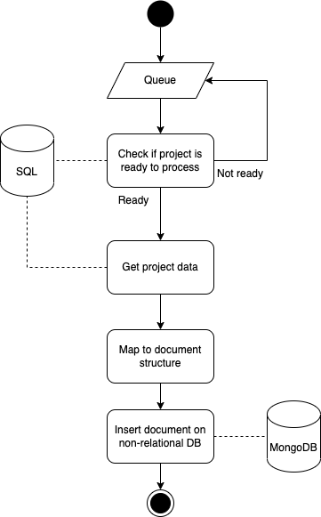

# Mirror service

The mirror service consumes a queue on RabbitMQ, in order to discover every new project that is being crawled. At each new project (ie, a new message in the queue), the Mirror service gets the project's data in the relational database and checks if the `ready` flag is checked. If so, it insert the project whole data as a document in a non-relational database.

To communicate with the relational database, we'll use [Prisma](https://www.prisma.io/) as our ORM. Its setup is very straight-forward and Prisma have great docs. But, in summary, we've ran `npx prisma init` to initialize the Prisma library. Then, we've set our connection string in our `.env` file (which you can copy and paste from the `.env.copy` file), then we run `npx prisma db pull` to generate Prisma's schema, and `npx prisma generate` to generate the Prisma Client. Doing so, we can use the PrismaClient directly in our code, by importing it from `@prisma/client`.

Our queue was created through RabbitMQ, which is set in our docker-compose. To communicate with RabbitMQ, we're using the [AMQ](https://www.rabbitmq.com/tutorials/tutorial-one-javascript.html) library, as suggested by the RabbitMQ docs. The Docker Image used to create our RabbitMQ already has a management dasboard, which can be very helpful to debug. To access the dashboard, just access http://localhost:15672/

Finally, we're using the [Mongoose](https://mongoosejs.com/) library to communicate with the non-relational database, which in this case is a MongoDB Server. The MongoDB Server is also created through our docker-compose environment. Also, we're using the [MongoDB Compass](https://www.mongodb.com/products/compass) as an IDE to help up to manage the MongoDB collections.

To run this service, just go and `yarn dev`

